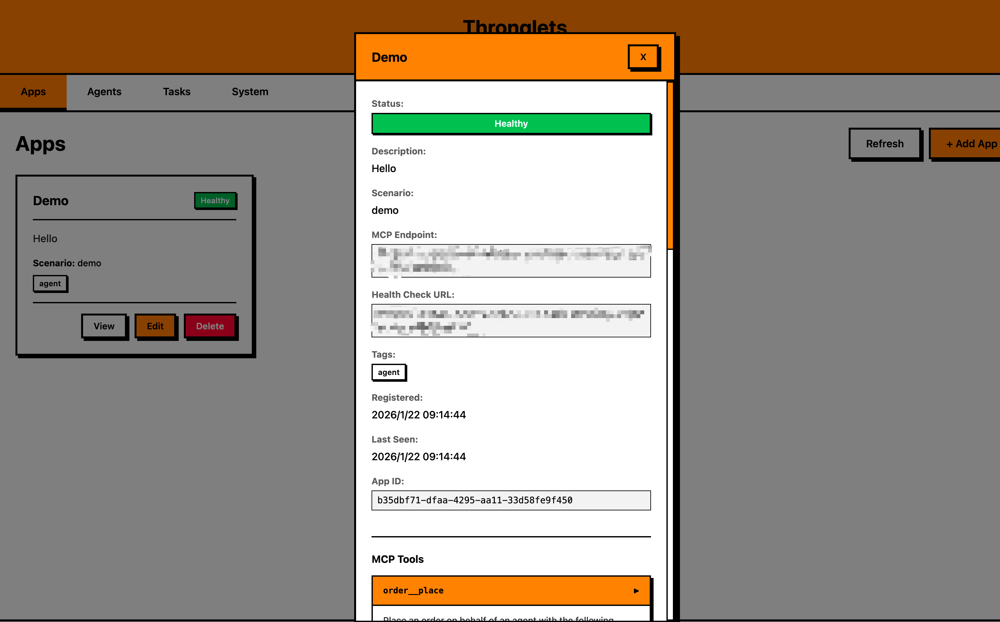
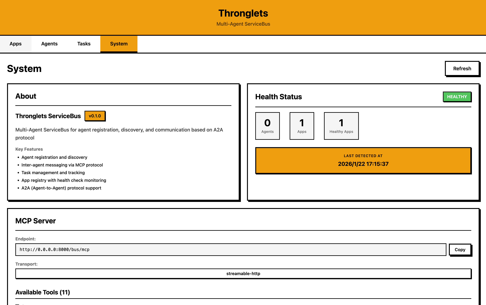

# Thronglets - The Agent Operating System

Thronglets is the universal platform where AI agents discover, collaborate, and access specialized services. One system to orchestrate your entire agent ecosystem.


## Quick Overview






## Key Features

### Agent Discovery & Communication
- **Agent Registration**: Agents register themselves on startup and become discoverable by other agents
- **Inter-Agent Messaging**: Send and receive messages between agents to coordinate complex tasks
- **Heartbeat-Based Lifecycle**: Automatic cleanup of inactive agents (configurable TTL)

### App Registry & Dynamic MCP
- **Scenario-Based Apps**: Register specialized MCP services (finance, gaming, data analysis, etc.)
- **Health Check Lifecycle**: Apps are monitored via health checks with automatic removal of unhealthy services
- **Dynamic Tool Discovery**: Agents can discover available tools from any registered App at runtime
- **Proxy Execution**: Execute App tools through ServiceBus without direct connection (`app__execute`)
- **Session Isolation**: Each Agent maintains independent MCP sessions with Apps for state isolation
- **Context Inheritance**: Agent session metadata automatically propagates to App calls

### Task Management
- **Task Creation & Tracking**: Create, monitor, and manage tasks with full state machine support
- **Task States**: submitted → working → completed/failed/cancelled
- **Context-Based Filtering**: Query tasks by context ID or status

### Pluggable Storage
- **Memory Storage**: Default in-memory storage for development
- **Redis Storage**: Production-ready Redis backend with configurable TTLs

## Architecture

```
┌─────────────┐     ┌─────────────┐     ┌─────────────┐
│   Agent A   │     │   Agent B   │     │   Agent C   │
│  (Search)   │     │   (Code)    │     │ (Analysis)  │
└──────┬──────┘     └──────┬──────┘     └──────┬──────┘
       │                   │                   │
       └───────────────────┼───────────────────┘
                           │
                           ▼
              ┌────────────────────────┐
              │   Thronglets ServiceBus │
              │                        │
              │  ┌──────────────────┐  │
              │  │    HTTP API      │  │  ← Agent/App Registration
              │  └──────────────────┘  │
              │                        │
              │  ┌──────────────────┐  │
              │  │   MCP Server     │  │  ← Agent Communication
              │  │   /bus/mcp       │  │    & Dynamic MCP Proxy
              │  └──────────────────┘  │
              │                        │
              │  ┌──────────────────┐  │
              │  │  Session Manager │  │  ← Agent-App Sessions
              │  └──────────────────┘  │
              │                        │
              │  ┌──────────────────┐  │
              │  │   App Registry   │  │  ← Health Check Lifecycle
              │  └──────────────────┘  │
              └────────────────────────┘
                           │
          ┌────────────────┼────────────────┐
          ▼                ▼                ▼
    ┌──────────┐    ┌──────────┐    ┌──────────┐
    │  App 1   │    │  App 2   │    │  App 3   │
    │ (Stock)  │    │ (Gaming) │    │(Analysis)│
    └──────────┘    └──────────┘    └──────────┘
```

## Quick Start

### 1. Register Your Agent

```python
from thronglets import BusClient, AgentCard

agent_card = AgentCard(
    name="my-agent",
    description="A sample agent",
    version="1.0.0",
)

with BusClient(url="http://localhost:8000", agent_card=agent_card) as client:
    print(f"Agent ID: {client.agent_id}")
    print(f"MCP Address: {client.mcp_address}")
    # Agent is registered, start working...
```

### 2. Inter-Agent Communication

Use MCP tools for agent-to-agent messaging:

```python
# Agent A sends a message to Agent B
message__send(to_agent_id="agent-b-id", content="Can you help me with this task?")

# Agent B receives messages
messages = message__receive()
```

### 3. Discover and Use Apps

```python
# List all available Apps (with tool counts)
apps = app__list()
# -> [{"name": "Stock Trading", "scenario": "finance", "tools_count": 5, ...}]

# Discover tools from a specific App
tools = app__list_tools(app_id="xxx")
# -> [{"name": "get_stock_price", "description": "...", "inputSchema": {...}}]

# Execute an App tool through ServiceBus
result = app__execute(
    app_id="xxx",
    tool_name="get_stock_price",
    arguments={"symbol": "AAPL"}
)
```

## API Overview

### HTTP API

| Endpoint | Description |
|----------|-------------|
| `POST /agents` | Register an agent |
| `GET /agents` | List all agents |
| `DELETE /agents/{id}` | Unregister an agent |
| `POST /apps` | Register an App (requires health_check_url) |
| `GET /apps` | List all Apps |
| `GET /apps/{id}` | Get App details |
| `GET /apps/{id}/tools` | Get App's MCP tools |
| `DELETE /apps/{id}` | Unregister an App |
| `POST /tasks` | Create a task |
| `GET /tasks` | List tasks |
| `GET /tasks/{id}` | Get task details |
| `POST /tasks/{id}/cancel` | Cancel a task |

### MCP Tools

| Tool | Description |
|------|-------------|
| `agent__list` | List all online agents |
| `agent__whoami` | Get current agent info |
| `message__send` | Send a message to another agent |
| `message__receive` | Receive messages |
| `app__list` | List available Apps (with optional tool summaries) |
| `app__get` | Get App details and MCP endpoint |
| `app__list_tools` | Discover tools provided by an App |
| `app__execute` | Execute an App tool through proxy |
| `task__create` | Create a new task |
| `task__get` | Get task details |
| `task__list` | List tasks with filters |
| `task__update_status` | Update task status |
| `task__cancel` | Cancel a task |

## Deployment

### Local Development

```bash
uv sync
uv run python main.py --port 8000
```

### Docker

```bash
docker build -t thronglets:latest --target production .
docker run -p 8000:8000 thronglets:latest
```

### Docker Compose

```bash
docker-compose up -d
```

### With Redis Storage

```bash
THRONGLETS_STORAGE_TYPE=redis THRONGLETS_REDIS_URL=redis://localhost:6379 \
    uv run python main.py --port 8000
```

## Documentation

- [Developer Guide](AGENT.md) - Detailed architecture, data models, and development instructions

## License

[Apache License](LICENSE)
